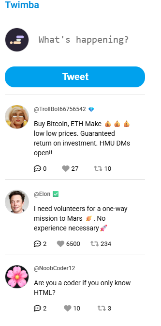
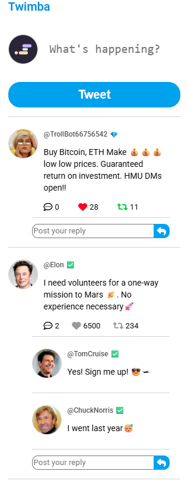
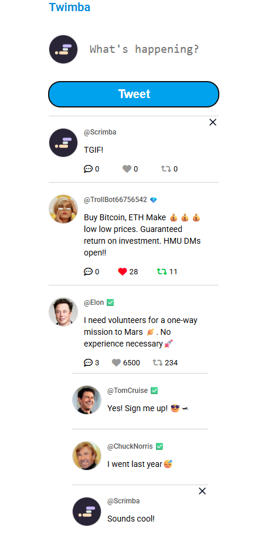
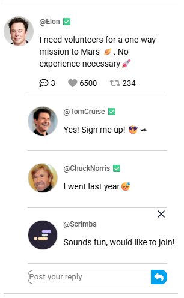

# Twitter Clone
A simple project attempting to recreate the basic functions of Twitter using HTML, CSS and JavaScript.

Initial Loading

 

Interaction with the icons

Added a new tweet

 

Added a new reply / comment

## Features / Implementation
* Tweet Data Storage
    - By default, the tweet data (an array of object) is stored in a separate JavaScript.
    - After each interaction, this tweet data will be saved in LocalStorage.
    - Afterwards, the tweet data will always be loaded from Local Storage, if possible.

* Basic Interaction on Twitter - **Like and Retweet**
    - As the like / retweet is clicked, the following event occurs:
        - Like Count increment / decrement by 1.
        - Like Icon and Retweet Icon changes its appearance.

* Basic Interaction on Twitter - **Reply / Comment**
    - As the reply / comment icon is clicked, the following event occurs:
        - The hidden reply / comment section is shown.
        - The reply / comment input section is shown.
    
    - As the user enter their reply / comment input using the given input section, the following event occurs:
        - The user's input comment is added into the comment / reply section.
        - Any user's own input comment / reply may be deleted by clicking the "X" on the top right corner.

    - Other features
        - The comment / reply action can be triggered by either clicking on the enter button or via a keyboard shortcut of "shift+enter".
        - The text box expand vertically as new lines are added in the comment / reply input until a maximum height is reached (where a vertical scroll will be implemented instead).

* Baisc Interaction on Twitter - **New Tweet**
    - Behave similarly to the reply / comment feature.
    - Can be triggered via either clicking the "Tweet" button or a keyboard shortcut of "shift+enter".
    - Any user's own posted tweet can be deleted by clicking on the "X" on the top right corner.

## Key Takeaways
1. Using 2 different CDNs
    - Font Awesome: for icons of comment / reply, like and retweets.
    - UUID: Create UUID for each tweet and comment / reply (which leads to easier element reference).

2. Detection of keyboard event using event of "keydown"
    - Allow users to enter tweet and reply / comment using "shift+enter".

3. Using *event.preventDefault()* to 
    - allow the detection of keyboard shortcut of "shift+enter" without causing an extra newline in the input area after the detection.

## Future Implementation
1. Load Contents to be rendered from a server instead of storing them locally.
    - To achieve infinite scrolling.

2. Implement user interface for retweet.
    - Require a modal to pop up for the users to enter the tweet text.
    - Should share various same mechanisms / codes as how a new tweet is posted.
    - New tweet section is needed to display tweeted text and tweeted text.
